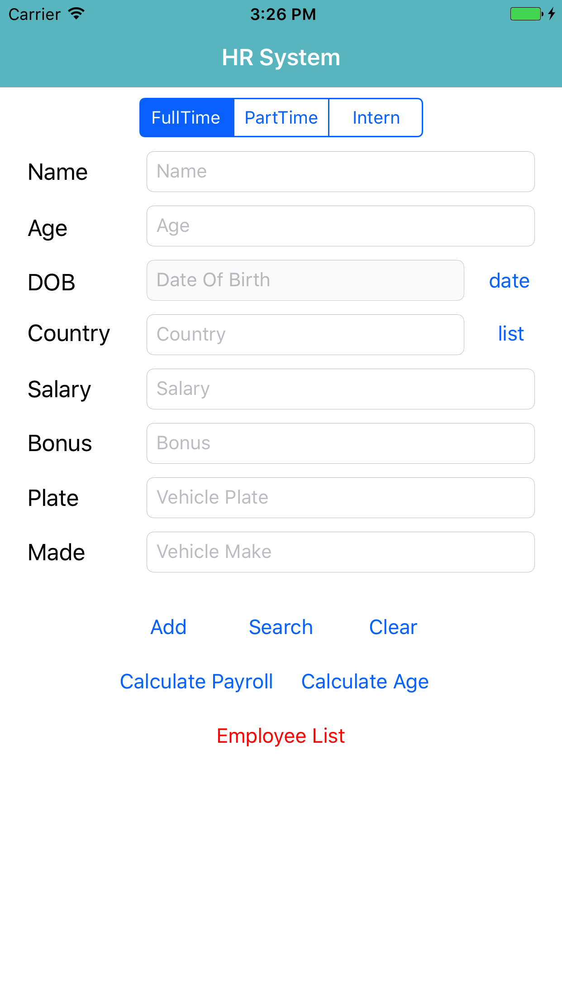
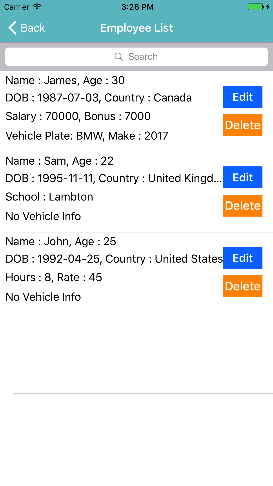
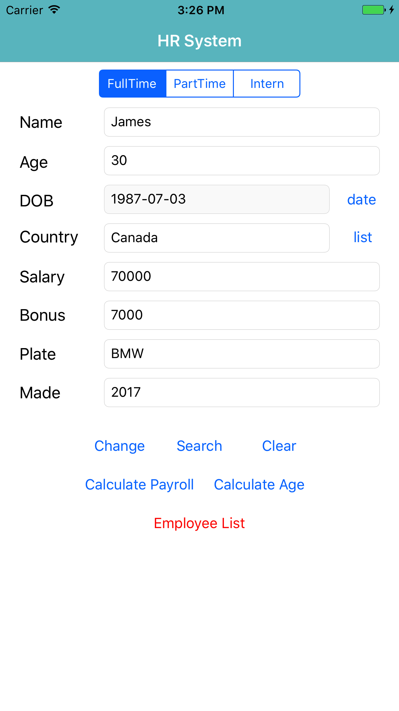
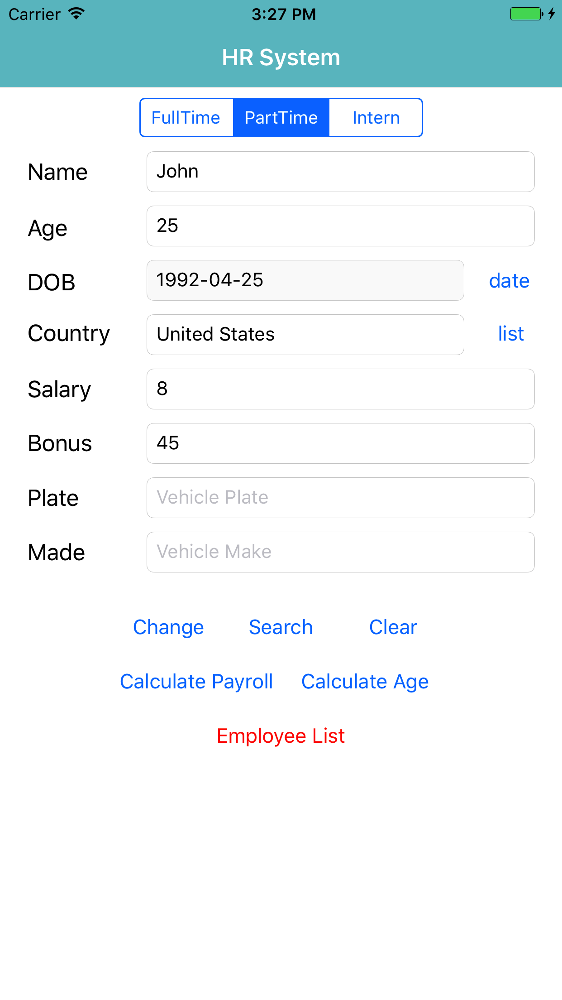
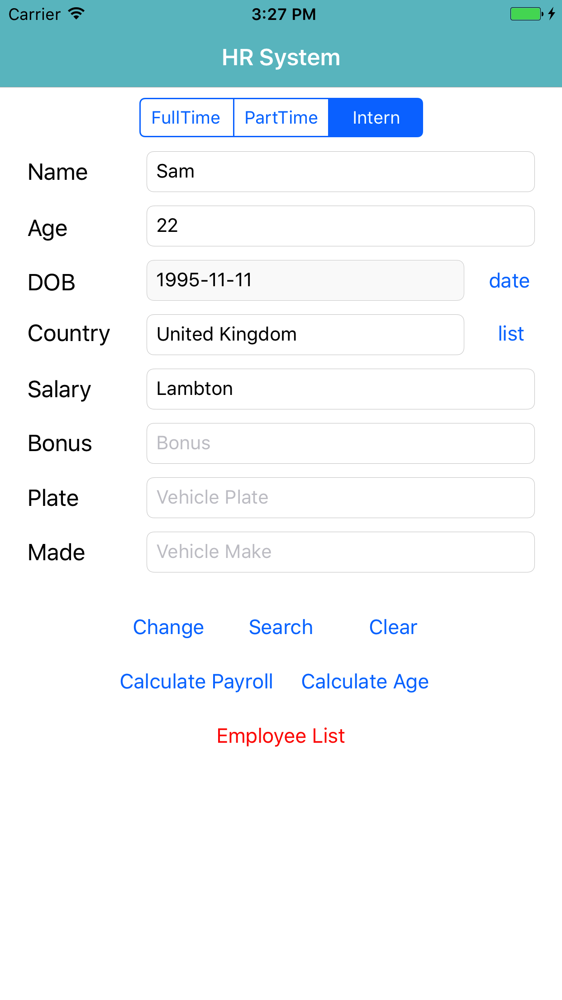
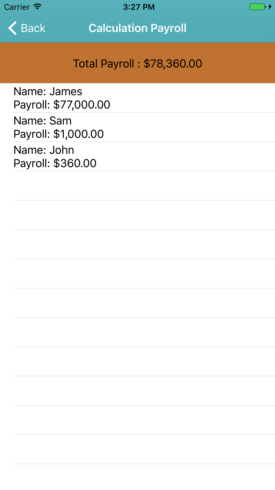

# Project Name : HRSysIOSApp 

## Features

This is a personal project for implementing a iOS app which manages Employee Information

- Add, Change Employee Information (Three Type Employee)
- Calculation Payroll List 
- Calculate Age 
- View / Search Employee List (Edit/Delete) 

## Screenshot

  
  
  

  
  
  

